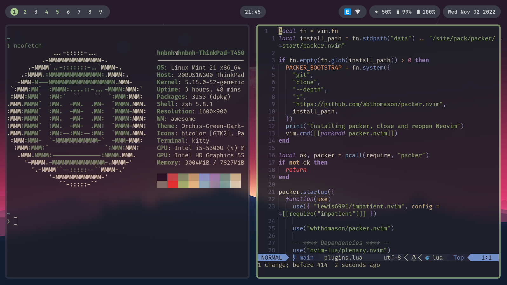

# ~/dotfiles

## TODO

- [ ] Support Fedora
- [ ] Support Arch (EndeavourOS)
- [ ] Support macOS
  - [ ] Configuration
    - [ ] yabai, skhd
    - [ ] sketchybar

## Acknowledgments

* [dot](https://github.com/folke/dot)
* [config_manager](https://github.com/tjdevries/config_manager)
* [nvim-config](https://github.com/jdhao/nvim-config)
* [LunarVim](https://github.com/LunarVim/LunarVim)
* [linux-setup](https://github.com/khuedoan/linux-setup)
* [macos-setup](https://github.com/khuedoan/macos-setup)
