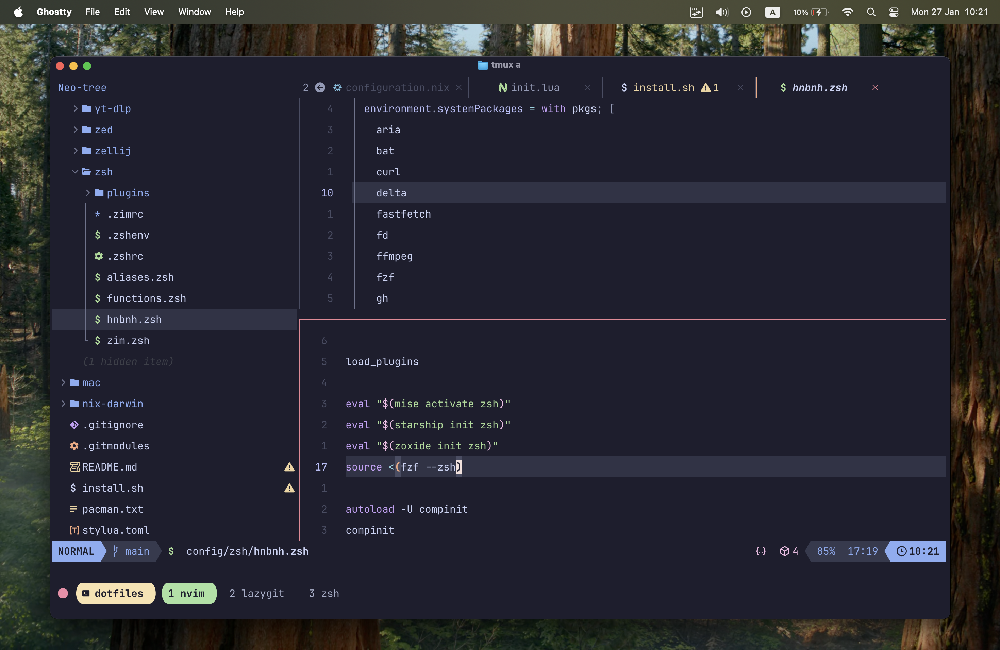

# ~/dotfiles & automated machine setup

> Commit hash: [1bc1701](https://github.com/hnbnh/dotfiles/tree/1bc170100bf58d01b002498b6b9adbba1d306e19)



## Installation

> [!WARNING]
> Consider forking this repo

```bash
git clone --recurse-submodules -j8 git@github.com:hnbnh/dotfiles.git
sudo ./install.sh
```

## TODO

- [ ] All

  - [ ] Add a cron job to send a notification of `Hydrate 💧`

    - [ ] Linux

      ```bash
      */20 * * * * notify-send "Health notification" "Hydrate 💧"
      ```

    - [ ] macOS

      ```bash
      */20 * * * * osascript -e 'display notification "Hydrate 💧" with title "Health notification"'
      ```

- [ ] Support nix
- [ ] Support macOS
  - [ ] System Settings > Privacy & Security > Full Disk Access > Toggle `Terminal`
  - [ ] Configuration
    - [ ] Enable Night Shift

## Acknowledgments

- [folke/dot](https://github.com/folke/dot)
- [tjdevries/config_manager](https://github.com/tjdevries/config_manager)
- [jdhao/nvim-config](https://github.com/jdhao/nvim-config)
- [LunarVim/LunarVim](https://github.com/LunarVim/LunarVim)
- [khuedoan/linux-setup](https://github.com/khuedoan/linux-setup)
- [khuedoan/macos-setup](https://github.com/khuedoan/macos-setup)
- [FelixKratz/dotfiles](https://github.com/FelixKratz/dotfiles)
- [LazyVim/LazyVim](https://github.com/LazyVim/LazyVim)
- [dreamsofautonomy/zen-omp](https://github.com/dreamsofautonomy/zen-omp)
