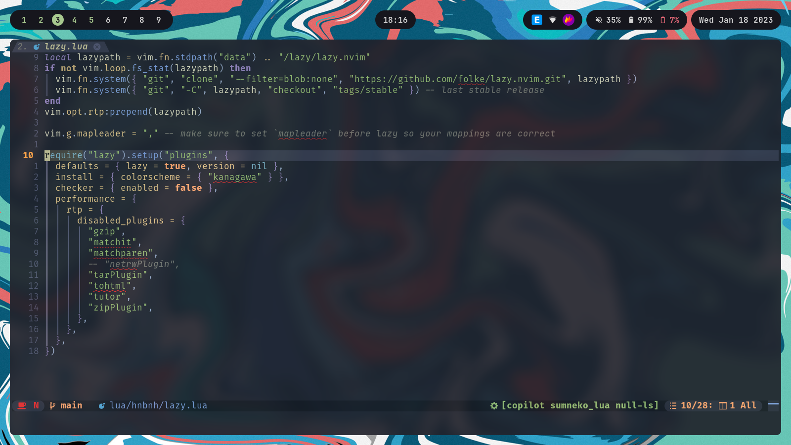

# ~/dotfiles



## Install

```bash
sudo ./install.sh
```

## TODO

- [ ] Support Fedora
- [ ] Support Arch (EndeavourOS)
- [ ] Support macOS
  - [ ] Add flake.lock
  - [ ] Configuration
    - [ ] yabai, skhd
    - [ ] sketchybar
    - Built-in
      - [ ] Disable `Desktop & Dock` -> `Mission Control` -> `Automatically rearrange Spaces based on most recent use`
      - [ ] Enable `Accessibility` -> `Display` -> `Reduce motion`

## Acknowledgments

- [folke/dot](https://github.com/folke/dot)
- [tjdevries/config_manager](https://github.com/tjdevries/config_manager)
- [jdhao/nvim-config](https://github.com/jdhao/nvim-config)
- [LunarVim/LunarVim](https://github.com/LunarVim/LunarVim)
- [khuedoan/linux-setup](https://github.com/khuedoan/linux-setup)
- [khuedoan/macos-setup](https://github.com/khuedoan/macos-setup)
- [FelixKratz/dotfiles](https://github.com/FelixKratz/dotfiles)
- [LazyVim/LazyVim](https://github.com/LazyVim/LazyVim)
