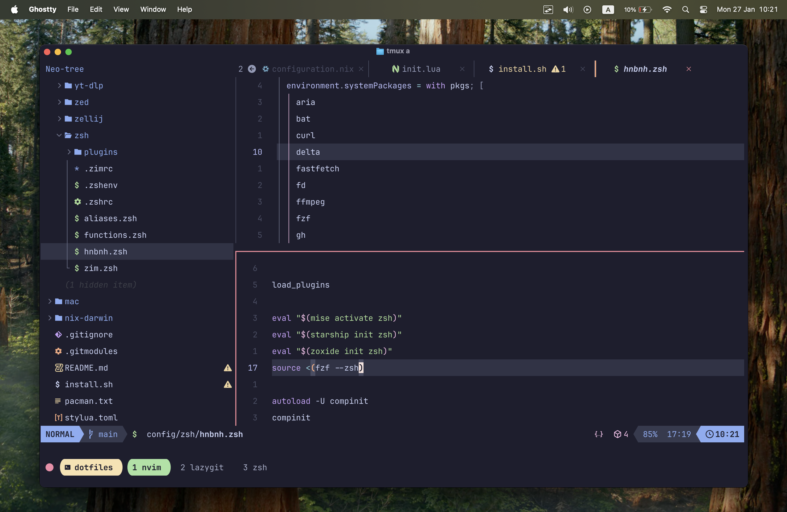

# Dotfiles and machine setup

> Commit hash: [1bc1701](https://github.com/hnbnh/dotfiles/tree/1bc170100bf58d01b002498b6b9adbba1d306e19)



## Installation

> [!WARNING]
> Fork this repository before using it.

```bash
git clone --recurse-submodules -j8 git@github.com:hnbnh/dotfiles.git ~/dotfiles
cd ~/dotfiles
./install.sh
```

Keep the repository at `~/dotfiles`; the dotfile symlinks depend on it.

On macOS, the installer sets up Nix, Homebrew, and nix-darwin. Apply later
changes with:

```bash
darwin-rebuild switch --flake ~/dotfiles#hnbnh
```

On Linux (Fedora 44+), the installer uses Fedora's packaged Nix, then
[system-manager](https://github.com/numtide/system-manager) for the system
layer (`/etc`, systemd units) and standalone home-manager for the user layer
(packages, dotfiles, Hyprland). Apply later changes with:

```bash
system-manager switch --flake ~/dotfiles --sudo   # modules/system
home-manager switch --flake ~/dotfiles#hnbnh      # modules/linux.nix
```

Only Fedora's own `nix`, `greetd`, and `tuigreet` RPMs are used; everything
else comes from nixpkgs. Steps that neither manager can express on a non-NixOS
host (login shell, GPU driver link, enabling greetd) live at the end of
`setup_linux` in `install.sh` and are safe to re-run.

Files in `modules/home/` are linked live, so edits apply immediately. Rebuild
only after adding or removing files. Add new files to Git before rebuilding.

For a config directory that stores state, logs, sockets, or credentials, add a
`.split` file so its contents are linked individually:

```bash
touch modules/home/.config/<tool>/.split
```

## TODO

- [ ] All

  - [ ] Add a cron job to send a notification of `Hydrate 💧`

    - [ ] Linux

      ```bash
      */20 * * * * notify-send "Health notification" "Hydrate 💧"
      ```

    - [ ] macOS

      ```bash
      */20 * * * * osascript -e 'display notification "Hydrate 💧" with title "Health notification"'
      ```

## Acknowledgments

- [folke/dot](https://github.com/folke/dot)
- [tjdevries/config_manager](https://github.com/tjdevries/config_manager)
- [jdhao/nvim-config](https://github.com/jdhao/nvim-config)
- [LunarVim/LunarVim](https://github.com/LunarVim/LunarVim)
- [khuedoan/linux-setup](https://github.com/khuedoan/linux-setup)
- [khuedoan/macos-setup](https://github.com/khuedoan/macos-setup)
- [FelixKratz/dotfiles](https://github.com/FelixKratz/dotfiles)
- [LazyVim/LazyVim](https://github.com/LazyVim/LazyVim)
- [dreamsofautonomy/zen-omp](https://github.com/dreamsofautonomy/zen-omp)
